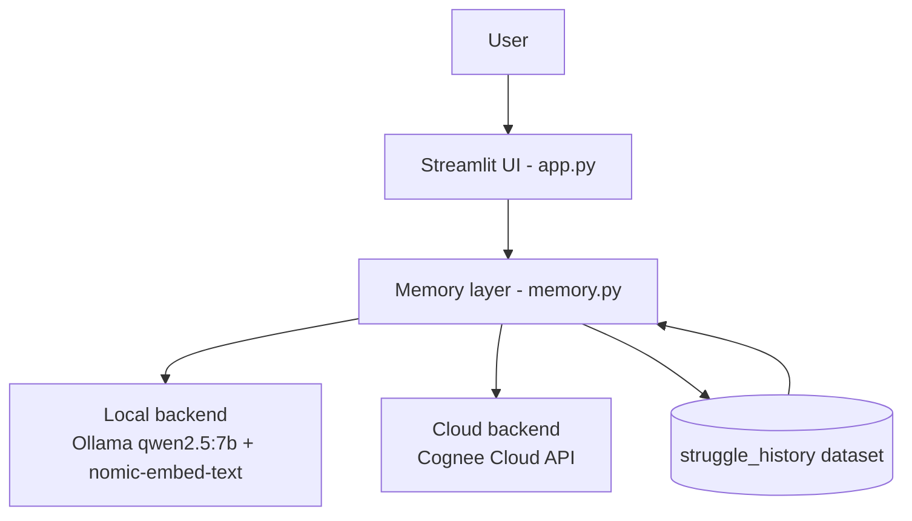

# 🧠 StudyMate AI

StudyMate AI is an AI-powered study companion built with **Streamlit** that turns your notes into an adaptive learning system. It remembers what you've studied, tracks where you struggle, and uses that memory to generate quizzes, flashcards, study plans, knowledge graphs, and exam predictions tailored to you.

Under the hood it uses **Cognee** (local or cloud) as a memory/knowledge-graph layer and **Ollama** (Qwen2.5) for local LLM inference — so it can run fully offline, or connect to Cognee Cloud.

---

## ✨ Features

| Tab | What it does |
|---|---|
| 📄 **Notes** | Paste raw notes or upload a PDF; content is chunked, embedded, and indexed into memory |
| 💬 **Ask** | Ask questions about your notes — answers adapt to your past learning style and difficulty level |
| 📝 **Quiz** | Auto-generated quizzes from your notes, with struggle tracking saved back to memory |
| 🔁 **Flashcards** | AI-generated flip flashcards for quick revision |
| 📅 **Study Plan** | Personalized study plan generated from your topics and weak areas |
| 🕸️ **Knowledge Graph** | Visual graph of key concepts and how they relate, extracted from your notes |
| 🎯 **Exam Predictor** | Predicts your expected exam score, confidence, weak topics, and revision hours needed |
| ⚙️ **Settings** | Switch between Local (Ollama) and Cloud (Cognee) backends, manage/delete topics, reset memory |

It also tracks a **Learning DNA** profile (learning styles, knowledge %, confidence %, exam readiness) and **Achievements** based on your study activity.

---

## 🏗️ Tech Stack

- **Frontend:** [Streamlit](https://streamlit.io/)
- **Memory / Knowledge Graph:** [Cognee](https://www.cognee.ai/) (local or cloud mode)
- **Local LLM & Embeddings:** [Ollama](https://ollama.com/) — `qwen2.5:7b` (chat) + `nomic-embed-text` (embeddings)
- **PDF parsing:** `pypdf`
- **Async handling:** `asyncio` + `nest_asyncio` (to run async Cognee calls inside Streamlit)

---

## 📦 Requirements

- Python 3.10+
- [Ollama](https://ollama.com/) installed and running locally (for Local mode)
- Pulled models:
  ```bash
  ollama pull qwen2.5:7b
  ollama pull nomic-embed-text
  ```
- (Optional) A [Cognee Cloud](https://www.cognee.ai/) account if you want to use Cloud mode instead of local Ollama

### Python packages

```bash
pip install -r requirements.txt
```

---

## ⚙️ Setup

1. **Clone the repo**
   ```bash
   git clone https://github.com/Darshan-coder-sru/studymate-ai.git
   cd studymate-ai
   ```

2. **Start Ollama** (for local mode) and pull the required models:
   ```bash
   ollama serve
   ollama pull qwen2.5:7b
   ollama pull nomic-embed-text
   ```

3. **(Optional) Configure Cognee Cloud** — create a `.env` file in the project root if you plan to use Cloud mode:
   ```env
   COGNEE_BASE_URL=your_cognee_cloud_url
   COGNEE_API_KEY=your_api_key
   COGNEE_TENANT_ID=your_tenant_id
   ```

4. **Run the app**
   ```bash
   streamlit run app.py
   ```

5. Open the local URL Streamlit prints (usually `http://localhost:8501`).

---

## 🏛️ Architecture



The memory layer is the core differentiator: every quiz answer, weak topic, and struggle gets written back into a `struggle_history` dataset, which then feeds future quiz generation, the Learning DNA profile, and the exam predictor — so the app actually adapts to the student over time instead of just answering questions about static notes.

## 🧭 Usage

1. Go to **📄 Notes** and paste your notes or upload a PDF.
2. Head to **💬 Ask** to quiz the AI about your material.
3. Use **📝 Quiz** and **🔁 Flashcards** to test and reinforce what you've learned.
4. Check **🕸️ Knowledge Graph** to visualize how concepts connect.
5. Use **🎯 Exam Predictor** to see your projected score and where to focus.
6. Switch memory backends or manage/delete topics anytime under **⚙️ Settings**.

---

## 🔀 Memory Backends

StudyMate AI supports two modes, switchable from the **Settings** tab:

- **Local (Ollama)** — everything runs on your machine, no API key needed.
- **Cloud (Cognee)** — offloads memory/search to Cognee Cloud; requires `COGNEE_BASE_URL` and `COGNEE_API_KEY` in your `.env` file.

---

## 📁 Project Structure

```
studymate-ai/
├── app.py             # Streamlit UI — tabs, styling, and page logic
├── memory.py          # Cognee/Ollama integration — notes, quizzes, DNA, exam prediction
├── requirements.txt   # Python dependencies
├── .env.example       # Template for Cognee Cloud credentials (optional)
└── README.md
```

---

## 🤝 Contributing

Issues and pull requests are welcome! If you spot a bug or have a feature idea, feel free to open an issue.

---

## 📄 License

Add your preferred license here (e.g. MIT).